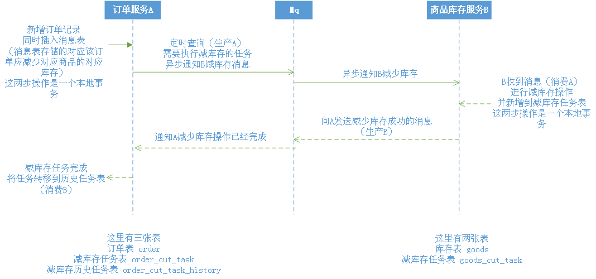

# 基于Spring Boot + RabbitMQ + 任务调度（异步）实现分布式事务的一致性
基于Spring Boot + RabbitMQ + 任务调度（异步）实现分布式事务的一致性，这里只是简单实现，主要是为了理解多个服务间实现事务的一致性，实际微服务可能使用Spring Cloud一系列组件

如果不了解分布式事务，可以先去了解CAP定理，XA协议等知识

我了解的实现分布式事务一致性的方式
    
    1、基于2PC（XA协议）
    2、TCC（代码补偿）
    3、MQ（像RabbitMQ，这类暂不支持事务消息的MQ） + 本地事务表，实现事务的最终一致
    4、使用RocketMQ事务消息
    
这个项目的代码，是使用RabbitMQ + 本地事务表 + 任务调度（异步）实现分布式事务的最终一致性

下面是简单的时序图：

[RabbitMQ安装](https://www.rabbitmq.com/download.html)

MySql5.7的安装，我使用的是二进制包进行安装，它的安装看自己习惯

MySql可以参考我的 mysql-install.sh 进行安装

----
### 测试步骤

1、首先，配置2台不同MySql5.7服务器，一台作为商品服务（192.168.88.129），另一台作为订单服务（192.168.88.130）

2、安装RabbitMQ到192.168.88.129这台服务器，你也可以使用其他服务器作为RabbitMQ的服务器

3、分别执行目录下的sql文件，我测试的配置是：

    服务器：192.168.88.129 商品服务 
        192.168.88.129.sql
    服务器：192.168.88.130 订单服务
        192.168.88.130.sql
    MySql授权：
        mysql-grant.sql

4、启动2个服务，商品服务与订单服务

    GoodsServiceApplication    
    OrderServiceApplication
    

5、浏览器访问 http://locahost:12345/order/test 生成订单

    可以使用postman、ab、wrk、jmeter等工具去测试

#### 说明
    由于先使用PHP实现的MQ的分布式事务，沿用的是PHP测试时的表结构，时间戳我习惯用的是int，字符串等可能和java习惯不符
    大家可以改成自己习惯的格式

